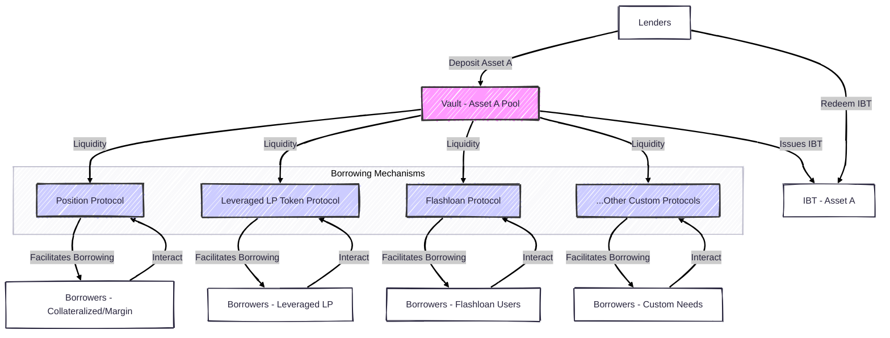

## 2. Protocol Overview: The Core Architecture

Yeap Finance facilitates seamless, efficient, and highly flexible lending and borrowing of digital assets. Its architecture revolves around two primary, interoperable components: **Vaults** and **Borrow Protocols**.

This section provides a high-level view of these components and their synergy. For more detailed explanations, please refer to the "Core Components" section.

### Key Architectural Pillars:

* **Isolated Asset Pools (Vaults):** Each vault manages a single cryptographic asset, ensuring risk isolation.
* **Interest-Bearing Tokens (IBTs):** Lenders receive IBTs representing their share and accrued interest.
* **Configurable Interest Rate Models (IRMs):** Vault creators can select and customize IRMs (Fixed, Variable, Dynamic).
* **Modular Borrowing Functionality (Borrow Protocols):** Distinct systems defining rules for borrowing from vaults (e.g., Position Protocol, Leveraged LP Token Protocol, Flashloan Protocol).
* **Extensibility:** The architecture allows for the integration of new, custom Borrow Protocols.

### The Synergy of Vaults and Borrow Protocols

The true innovative power of Yeap Finance emerges from the synergistic and decoupled relationship between Vaults and Borrow Protocols. Vaults act as the secure, specialized repositories and yield-generating engines for individual assets, managed according to their unique IRMs. Borrow Protocols, in turn, act as versatile, pluggable "gateways" or "lending interfaces" that define *how* the liquidity within those vaults can be accessed and utilized.

This decoupling means:

* **Maximized Capital Efficiency**: A single pool of capital can serve multiple use cases simultaneously.
* **Tailored Risk Exposure for Lenders (Indirectly)**: Vault configuration shapes the risk profile.
* **Adaptability and Future-Proofing**: New Borrow Protocols can be integrated without overhauling the core system.

The following diagram illustrates this synergy:

### Operational Flow Overview

1.  **Lending Process**: Lenders deposit assets, receive IBTs, and accrue interest.
2.  **Borrowing Process**: Borrowers select a vault and an associated Borrow Protocol to access funds.
3.  **Vault Governance Process**: Vault creators define initial parameters and can adjust them over time based on the chosen governance structure.

For detailed information on Vaults and Borrow Protocols, please see the "Core Components" section.
