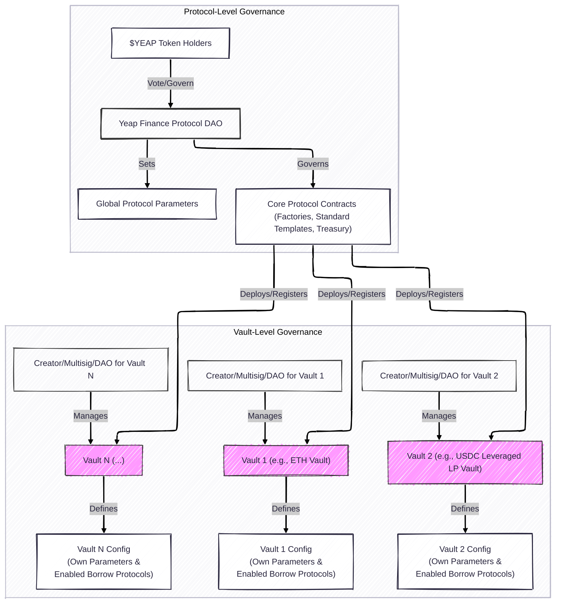

# Governance and Decentralization

Yeap Finance is committed to a progressively decentralized governance model, ensuring that the protocol evolves in alignment with the interests of its users and the broader community, fostering resilience and long-term sustainability.

### Vault-Level Governance: Empowerment at the Source

A unique and defining aspect of Yeap Finance is its emphasis on decentralized governance at the individual vault level, providing unprecedented autonomy to vault creators and their communities.

* **Creator-Defined Governance**: When a vault is created, its initiator (an individual, a multisig group, or a DAO) defines the specific governance rules and operational parameters for *that particular vault*. This includes, but is not limited to:
    * Selection and configuration of the Interest Rate Model (IRM).
    * Determination of which Borrow Protocols can interface with the vault.
    * Setting parameters for each enabled Borrow Protocol (e.g., accepted collateral types, LTVs, LLTVs for a Position Protocol; supported LP tokens, their LTVs, and specific risk parameters for a Leveraged LP Token Protocol).
    * Defining origination fees, flash loan fees, liquidation penalties/bonuses, and other applicable charges.
    * Specifying the allocation of collected fees.
    * Whitelisting or enabling new Borrow Protocol types for use with the vault over time.
* **Flexible Governance Structures**: This model supports a variety of control mechanisms:
    * **Individual Control**: Ideal for rapid experimentation or personal use.
    * **Multisig Control**: For teams or investment groups requiring shared responsibility.
    * **DAO Governance**: For projects or communities managing vaults via token-based voting.

### Protocol-Level Governance (Potential Future State with $YEAP Token)

While vault-level governance provides immediate decentralization, a native protocol token (e.g., $YEAP) could facilitate broader, protocol-wide governance in the future. Its potential functions would typically involve:

* **Upgrading Core Protocol Contracts**: Approving new versions or critical updates.
* **Managing the Protocol Treasury**: Overseeing collection and allocation of protocol-level fees.
* **Ratifying New Standardized Borrow Protocols**: Voting on "officially recognized" Borrow Protocol types.
* **Setting Global Protocol Parameters**: If any such parameters exist that are not vault-specific.
* **Oracle Network Selection/Prioritization**: Influencing decisions on supported oracle networks.
* **Ecosystem Development Initiatives**: Directing resources towards strategic partnerships and community growth.

### Path to Full Decentralization

Yeap Finance is envisioned to transition towards increasing community ownership and control over time. The long-term objective is for $YEAP token holders (if implemented) or a similar robust decentralized mechanism to have ultimate authority over the protocol's evolution.

The following diagram illustrates the two-tiered governance model:

### Smart Contract Upgradeability

Protocol upgrades are essential and will be approached with caution, transparency, and security best practices:

* **Mandatory Timelocks**: Significant upgrades to protocol-level contracts will be subject to a mandatory timelock, allowing time for review and community response.
* **Governance Control over Upgrades**: Authority for protocol-level upgrades will reside with the Yeap Finance DAO. Vault-level upgradeability depends on the creator's chosen mechanism.
* **Clarity and Documentation**: Clear documentation will delineate upgradeable and immutable contracts.
* **Emergency Mechanisms (Highly Restricted & Phased Out)**: A narrowly defined emergency override, controlled by a security multisig, might exist initially but would be phased out as DAO governance matures.
