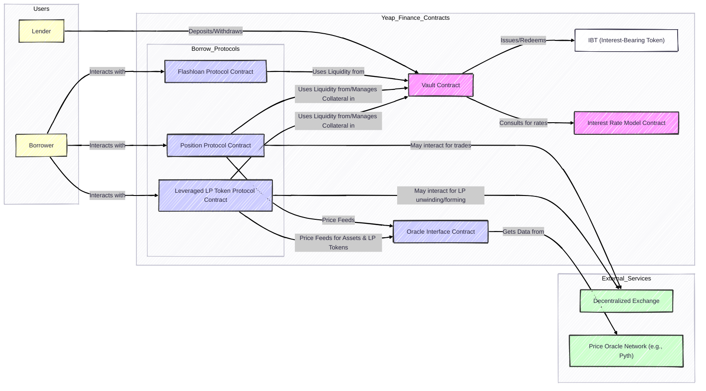

## 4. Technical Architecture

Yeap Finance’s infrastructure is meticulously designed for security, efficiency, and scalability, primarily leveraging the unique strengths of the **Move programming language**, which is gaining prominence in blockchains like Aptos and SUI due to its strong safety features.

### 4.1. Core Smart Contracts

The protocol is composed of several key, interoperable smart contract modules:

* **Vault Contracts**: These are the central pillars for each lending pool.
    * *Key Functions*: Securely manage asset deposits and withdrawals; meticulously track interest accrual based on the chosen IRM and actual borrowing activity; issue and redeem unique Interest-Bearing Tokens (IBTs) for each vault; enforce liquidity constraints; and provide data feeds for utilization and other metrics.
* **Borrow Protocol Contracts**: Each type of Borrow Protocol (e.g., Position Protocol, Leveraged LP Token Protocol, Flashloan Protocol) is a distinct set of smart contracts defining specific borrowing logic, risk parameters, and user interaction flows.
    * *Leveraged LP Token Protocol Contract*: This contract is particularly sophisticated, containing logic for validating and pricing collateral, managing collateralization ratios, handling borrowing of underlying assets, and executing liquidations of leveraged LP positions.
* **Interest Rate Model (IRM) Contracts**: These are pluggable, standalone smart contract modules, each containing the specific logic for a different interest rate calculation strategy.
* **Oracle Interface Contracts**: These contracts serve as secure intermediaries to fetch external data, primarily asset prices, from decentralized oracle networks. For LP tokens, these interfaces might connect to more specialized oracle solutions or on-chain TWAP modules.
* **Factory Contracts**: These contracts are responsible for the permissionless deployment of new Vault instances and potentially for registering new, standardized Borrow Protocol templates.

### 4.2. Smart Contract Interactions (High-Level)

1.  A **Lender** interacts with a specific **Vault Contract** to deposit assets and receive IBTs.
2.  A **Borrower** interacts with a specific **Borrow Protocol Contract** linked to one or more Vault Contracts.
    * If using a **Position Protocol**, the borrower provides collateral. The Position Protocol consults the Oracle Interface Contract for prices and allows borrowing from associated Vault Contracts.
    * If using a **Leveraged LP Token Protocol**, the borrower deposits LP tokens or underlying assets. The protocol consults oracles, then allows borrowing of necessary assets from their respective Vault Contracts.
    * If using a **Flashloan Protocol**, it temporarily draws liquidity from associated Vault Contracts, ensuring repayment within the same transaction.
3.  The **Vault Contract** consults its designated **Interest Rate Model Contract** and utilization data to update interest accrual rates.

The diagram below provides a high-level overview of these smart contract interactions:

### 4.3. Advantages of the Move Language

The choice of the Move language is a significant technical differentiator aimed at enhancing security, correctness, and developer productivity:

* **Resource Model for Asset Safety**: Move's core design treats digital assets as "resources" with strong ownership semantics, preventing accidental duplication, deletion, or implicit copying.
* **Prevention of Reentrancy**: Move's execution model and strong type system significantly mitigate reentrancy attack vectors.
* **Formal Verification Capabilities**: Move is designed for formal verification, allowing mathematical proofs about contract correctness.
* **Modularity and Strong Abstraction**: Move's module system allows for clean separation of concerns and well-defined interfaces.
* **No "Drop" for Critical Resources**: Move can enforce that critical resources are explicitly accounted for.
* **Type Safety and Data Integrity**: Move's strong static typing helps catch errors at compile time.

### 4.4. Key Integrations

Yeap Finance is designed to be an integral part of the broader DeFi ecosystem:

* **Decentralized Exchanges (DEXs)**: Crucial for Leveraged LP Token Protocols and for users of the Position Protocol.
* **Oracles**: Reliable price feeds are paramount, especially for LP token valuation.
* **Wallets and Dashboards**: Essential for user accessibility and management of positions.
* **Other DeFi Protocols (Composability)**: IBTs are designed as standard fungible tokens for potential use elsewhere.

### 4.5. Scalability and Performance Considerations

* **Modular Design for Independent Scaling**: Separation of Vaults and Borrow Protocols allows independent scaling.
* **Efficient State Management**: Move's state model is designed for efficiency; contracts will be optimized.
* **Leveraging Underlying Layer 1 Scalability**: Benefits from the scalability features of the host Move-based blockchain.
* **Asynchronous Operations & Off-Chain Computation (Future Potential)**: Exploration for non-critical operations.
* **Optimized Data Structures and Algorithms**: Careful implementation for efficiency.

The overarching goal is to ensure Yeap Finance can handle significant transaction volume without compromising security, decentralization, or user experience.
